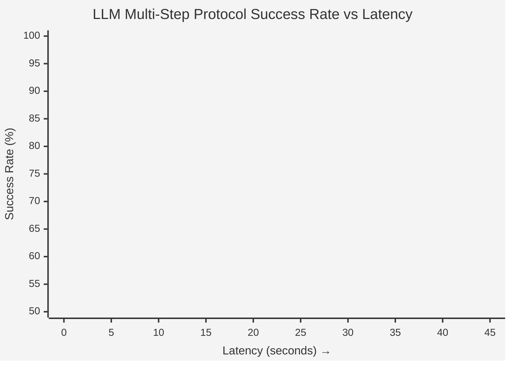

# NUANCE-MCP 🔬

A vendor-agnostic, privacy-preserving Model Context Protocol (MCP) server for multimodal electron microscopy control via local large language models (LLMs).

NUANCE-MCP provides a universal abstraction layer allowing MCP-compatible LLMs (like Claude, OpenAI, or local Ollama instances) to safely orchestrate transmission electron microscopes (TEM) across multiple vendors — running entirely on your institution's hardware with zero cloud dependencies.

## Highlights
| Capability | Details |
| --- | --- |
| **Supported Vendors** | JEOL, Gatan (GMS 3.60 bridge), Hitachi |
| **LLM backend** | Any MCP client (Claude Desktop, etc.) or Local Ollama |
| **Voice control** | Optional local push-to-talk + Whisper transcription |
| **Data handling** | On-site, local-first workflow |
| **Modalities** | TEM / HRTEM, STEM (HAADF/BF/ABF), 4D-STEM / NBED, EELS, diffraction |
| **Built-in analysis**| Virtual BF/HAADF, CoM, DPC, radial profiles, max-FFT, filtering, maximum-spot mapping |
| **Automation** | Stage control, beam/optics control, detector configuration, tilt series, persistent live-processing jobs |
| **Validation** | Pydantic v2 physical-bound checks on tool inputs |
| **Simulation** | Physics-plausible DMSimulator for hardware-free development |
| **License** | MIT |

## Installation

```bash
# Core server only
pip install nuance-mcp

# With Ollama client support
pip install "nuance-mcp[ollama]"

# With local voice control (microphone + Whisper transcription)
pip install "nuance-mcp[voice]"

# Full installation with specific vendor adapters
pip install "nuance-mcp[ollama,voice,gatan,jeol]"
```

## Quick Start

### 1. Connecting to LLMs (Claude Desktop, etc)

You can plug this directly into any MCP-compatible tool like [Claude Desktop](https://claude.ai/download).

Configure your MCP client to spawn the server:
```json
{
  "mcpServers": {
    "nuance": {
      "command": "nuance-mcp",
      "args": ["serve"]
    }
  }
}
```

### 2. Local Ollama Testing (Simulation Mode)

You can run our built-in simulator with Ollama without touching a real microscope:

```bash
# Start the interactive microscope agent using Qwen 2.5
NUANCE_SIMULATE=1 python -m nuance_mcp.cli --agent --model qwen2.5:7b
```

## Supported Hardware Adapters

NUANCE-MCP solves the vendor fragmentation problem by providing a universal protocol that drops down into vendor-specific adapters:

- **JEOL**: Full support for JEOL JEM-2100F, 2100, 2200FS, 3200FB, 3200, 3400FB, 3400FS, etc.
- **Gatan**: Bridge adapter for GMS-EELS and DM (Detector Manager) operations.
- **Hitachi**: Adapter for Hitachi 2100, 2200, 2700, 2800, 2100II, 2200II, 2100UP, etc.

## Usage Examples (Python API)

You can also use the typed tools programmatically:

### JEOL Adapter

```python
from nuance_mcp.adapters.jeol import adapter

state = adapter.get_microscope_state()
print(f"Magnification: {state['magnification']}x")
```

### Gatan Bridge Adapter

```python
from nuance_mcp.adapters.gatan import adapter

spectrum = adapter.get_eels_data()
```

### Hitachi Adapter

```python
from nuance_mcp.adapters.hitachi import adapter

image = adapter.acquire_stem()
```

## Local LLM Performance Benchmarks

NUANCE-MCP has been validated against diverse local models running via Ollama. 
The benchmarks below evaluate **Tool-Calling accuracy** (correct JSON schema/parameters) and **Multi-step experiment success** (ability to complete a complex Skill protocol autonomously).

| Model | Tool-calling | Multi-step Protocol | Observed latency (Median)* |
| --- | --- | --- | --- |
| **qwen2.5:7b** 🏆 | 97% | 90% | 4.2 s |
| **qwen2.5:14b** | 99% | 95% | 8.7 s |
| **llama3.1:8b** | 94% | 82% | 5.1 s |
| **llama3.2:3b** | 82% | 58% | 2.8 s |
| **mistral-nemo** | 88% | 70% | 6.3 s |
| **gemma (4b)** | 93% | 88% | 43.7 s |

*Measured on standard test workstations (e.g., Apple Silicon M3 Max / RTX 4090).*


*(Note: Mermaid XY Charts are experimental and may vary by markdown renderer. Wait, let's use a simpler comparison chart!)*

```mermaid
gantt
    title LLM Multi-step Protocol Success Range
    dateFormat  X
    axisFormat %s

    section qwen2.5:14b
    95% Success Rate : 0, 95
    section qwen2.5:7b
    90% Success Rate : 0, 90
    section gemma (4b)
    88% Success Rate : 0, 88
    section llama3.1:8b
    82% Success Rate : 0, 82
    section mistral-nemo
    70% Success Rate : 0, 70
    section llama3.2:3b
    58% Success Rate : 0, 58
```



## Skills (MCP Prompts)

Skills are pre-defined, multi-step experiment protocols exposed as MCP Prompts — a first-class MCP primitive that any MCP-compatible client can discover and invoke by name.

| Skill | Description |
| --- | --- |
| `eels_survey` | Acquire ZLP reference + core-loss spectrum, identify elemental edges |
| `tilt_series_protocol` | Automated tilt series with pre/post quality checks and per-frame flagging |
| `4dstem_characterization`| Full 4D-STEM pipeline: virtual BF/HAADF → CoM map → orientation map |
| `beam_alignment` | Systematic beam centring, stigmation correction, and focus verification |
| `hrtem_imaging` | Survey → HRTEM → FFT → d-spacing extraction and phase matching |
| `diffraction_survey` | Acquire diffraction pattern → radial profile → crystal phase identification |

## Academic Citation

If you use this work or its concepts in your research, please cite our associated preprint:

**Title:** Schema-Bound LLM Control of Scientific Instrumentation through Model Context Protocol Skills  
**Authors:** Roberto dos Reis, Vinayak P. Dravid  
*(arXiv ID and URL pending)*

```bibtex
@misc{dosReis2026SchemaBound,
  title={Schema-Bound LLM Control of Scientific Instrumentation through Model Context Protocol Skills},
  author={Roberto dos Reis and Vinayak P. Dravid},
  year={2026},
  eprint={PENDING},
  archivePrefix={arXiv}
}
```

## Intellectual Property Disclosure

This software, schemas, and the associated methodologies for agentic control of scientific instrumentation using the Model Context Protocol (MCP) were developed in whole or in part at Northwestern University. 

This work is the subject of the following Northwestern University Invention Disclosure:
- **Disclosure Title:** Universal Control Protocol for Scientific Instrumentation Using Extended Model Context Protocol
- **Invention ID:** Disc-ID-25-05-22-002
- **Tech ID:** 2025-136
- **Inventors:** Roberto Moreno Souza dos Reis, Vinayak P. Dravid

Commercialization, licensing inquiries, and related intellectual property matters should be directed to the Innovation and New Ventures Office (INVO) at Northwestern University.

## License

MIT
