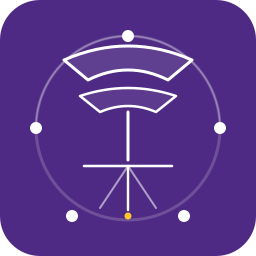

<p align="center">
  
</p>

<h1 align="center">nuance-mcp</h1>

<p align="center">
  <em>A vendor-agnostic, schema-bound Model Context Protocol server for local
  LLM-orchestrated multimodal electron microscopy.</em>
</p>

<p align="center">
  <a href="https://github.com/NUANCE-IT/nuance-mcp/actions/workflows/ci.yml"></a>
  <a href="https://nuance-it.github.io/nuance-mcp/"></a>
  <a href="https://pypi.org/project/nuance-mcp/"></a>
  <a href="https://www.python.org/downloads/"></a>
  <a href="LICENSE"></a>
  <a href="https://modelcontextprotocol.io"></a>
  <a href="https://www.nuance.northwestern.edu"></a>
</p>

<p align="center">
  <a href="#quick-start">Quick start</a> ·
  <a href="#adapters">Adapters</a> ·
  <a href="#examples">Examples</a> ·
  <a href="#skills">Skills</a> ·
  <a href="#documentation">Docs</a> ·
  <a href="#citation">Citation</a> ·
  <a href="#disclosure-and-ip">IP disclosure</a>
</p>

---

## What is `nuance-mcp`?

`nuance-mcp` connects local LLM agents — Ollama, Claude.ai, Microsoft 365
Copilot — to multimodal (S)TEM workflows through the **Model Context
Protocol** (MCP). The schema-bound tool layer, persistent live-job
lifecycle, declarative skill catalogue, and physics-plausible simulator
sit above an explicit `MicroscopeAdapter` contract. Reference adapters
for **Gatan** (GMS 3.60 via a ZeroMQ bridge) and **JEOL** (TEM3/PyJEM
in-process) ship in the same package alongside a **Hitachi** skeleton
and a hardware-free **simulator** backend.

The framework was developed at the [**NUANCE Center**](https://www.nuance.northwestern.edu)
at Northwestern University. It supersedes the v0.1 packages
`nuance-gms-mcp` (Gatan) and `jeol-mcp` (JEOL); see the
[migration guide](docs/migration_v0.1_to_v0.2.md) for details.

> [!IMPORTANT]
> **`nuance-mcp` provides _bounded execution at the tool boundary_, not
> full instrument safety.** Schema validation rejects out-of-range
> arguments before any vendor call is dispatched, but it is *not* a
> replacement for hardware interlocks, operator approval, beam-damage
> models, or facility-policy gates. See [`docs/safety.md`](docs/safety.md)
> for the layered safety model.

---

## Why?

Modern (S)TEM software is rich but fragmented across GUI panels,
scripting environments, and vendor-specific APIs. Three frictions
recur across every vendor stack we have worked with:

1. **Host-process binding.** Instrument APIs (DigitalMicrograph,
   PyJEM/TEM3, Velox, the Hitachi SDK) load only inside the vendor's
   acquisition process. An external Python interpreter cannot drive
   the column directly.
2. **Local-first governance.** Facility policy frequently forbids
   outbound connections from the microscope PC, which rules out
   cloud-only LLM backends.
3. **Bounded execution.** An LLM emitting natural language can produce
   arguments that are syntactically valid but physically unreasonable
   (`α = 95°`, `exposure = -1.0 s`). The protocol must reject such
   requests at the boundary, not mid-acquisition.

`nuance-mcp` addresses these at the level of the **tool protocol**,
not at the level of any single instrument. Once the schema layer,
the host-process boundary, the live-job lifecycle, and the
MCP-discoverable skills are right, the specific instrument software
becomes a swap-in adapter.

---

## At a glance

| Capability                | Detail                                                                                  |
|---------------------------|-----------------------------------------------------------------------------------------|
| **Tool surface**          | 30 typed tools — TEM/STEM/4D-STEM/EELS/diffraction + stage/optics + derived analyses    |
| **Skills**                | 6 vendor-portable MCP prompts (`eels_survey`, `tilt_series_protocol`, `4dstem_characterization`, `beam_alignment`, `hrtem_imaging`, `diffraction_survey`) |
| **Live processing**       | 5 persistent job classes (`radial_profile`, `difference`, `fft_map`, `filtered_view`, `maximum_spot_mapping`) |
| **Adapters**              | Gatan / JEOL / Hitachi (skeleton) / Simulator (default)                                 |
| **Schema validation**     | Pydantic v2 — bounded before any vendor call                                            |
| **Transports**            | `stdio` (primary, air-gap-compatible) · streamable HTTP at `/mcp` (optional)            |
| **Bridge spec**           | Versioned JSON contract — [`nuance-mcp-bridge/1.0`](docs/spec/nuance-mcp-bridge-1.0.md) |
| **Simulator**             | Physics-plausible NumPy/SciPy backend; bit-stable under fixed seed                      |
| **Voice control**         | Optional local-only push-to-talk via [`faster-whisper`](https://github.com/SYSTRAN/faster-whisper) |
| **Container**             | [`Dockerfile`](Dockerfile) + [`docker-compose.yml`](docker-compose.yml)                 |
| **Documentation**         | [`mkdocs-material`](https://nuance-it.github.io/nuance-mcp/) site                       |
| **License**               | MIT                                                                                     |

---

## Architecture

```
                ┌──────────────────────────────────────────────┐
   Agent  ─►    │  MCP Prompts (skills) — vendor-portable      │   ← core/skills.py
                │  Multi-step protocols composed from tools    │
                ├──────────────────────────────────────────────┤
                │  Typed MCP tools — schema-validated entry    │   ← tools/__init__.py
                │  ▸ Pydantic v2 input check at the boundary   │      core/schemas.py
                │  ▸ Live-job lifecycle (start/status/result)  │      core/lifecycle.py
                ├──────────────────────────────────────────────┤
                │  MicroscopeAdapter ABC — the contract        │   ← core/adapter.py
                │  ▸ Capabilities, methods, lifecycle          │      core/capabilities.py
                ├──────────────────────────────────────────────┤
                │  Vendor adapters                             │   ← adapters/<vendor>/
                │  ▸ Gatan   (ZeroMQ bridge to GMS)            │      adapters/gatan/
                │  ▸ JEOL    (PyJEM in-process)                │      adapters/jeol/
                │  ▸ Hitachi (skeleton)                        │      adapters/hitachi/
                │  ▸ Simulator (physics-plausible default)     │      core/simulator.py
                └──────────────────────────────────────────────┘
                                 ↕  (Gatan / Hitachi only)
                ┌──────────────────────────────────────────────┐
   Microscope   │  Vendor host process (DM, Hitachi SDK, …)    │
        PC      │  ZeroMQ REP socket ── bridge plugin          │
                └──────────────────────────────────────────────┘
```

Full layered design and rationale: [`docs/architecture.md`](docs/architecture.md).

---

## Quick start

### 1. Install

```bash
# Core only — runs against the simulator
pip install nuance-mcp

# With Gatan adapter (ZeroMQ bridge) and a local-LLM agent client
pip install "nuance-mcp[gatan,ollama]"

# With JEOL adapter (PyJEM is JEOL-proprietary; install separately)
pip install "nuance-mcp[jeol]"

# Everything (voice control included)
pip install "nuance-mcp[all]"
```

### 2. Start the server

```bash
nuance-mcp list-adapters                       # simulator · gatan · jeol · hitachi

nuance-mcp serve --adapter simulator           # no hardware required
nuance-mcp serve --adapter gatan               # GMS via the host-process bridge
nuance-mcp serve --adapter jeol                # PyJEM in-process
nuance-mcp serve --adapter gatan \
                 --transport http --port 8000  # optional remote MCP transport
```

### 3. Drive it from Python

```python
import asyncio, json
from nuance_mcp import build_server

async def main():
    server = build_server("simulator")
    res = await server.call_tool("get_microscope_state", {})
    print(json.loads(res.content[0].text))

asyncio.run(main())
```

### 4. Drive it from a local LLM agent

```python
import asyncio
from nuance_mcp import build_server
from nuance_mcp.agent import run_agent

async def main():
    server = build_server("gatan")
    answer = await run_agent(
        server,
        "Acquire a 256×256 HAADF STEM image at 5 µs dwell time and report "
        "the mean intensity.",
        model="qwen2.5:7b",
    )
    print(answer)

asyncio.run(main())
```

### 5. Container

```bash
docker compose up --build                      # nuance-mcp + Ollama, simulator
docker compose run --rm \
    -e NUANCE_MCP_ADAPTER=gatan \
    -e GMS_MCP_ZMQ=tcp://microscope-pc.lan:5555 \
    nuance-mcp                                 # point at a real Gatan microscope
```

See [`docs/quickstart.md`](docs/quickstart.md) for the five-minute walkthrough.

---

## Adapters

`nuance-mcp` ships four reference adapters. The **simulator** is the
default; the others select live or in-process vendor backends.

| Adapter          | Vendor / model        | Capabilities                                                              | Transport to vendor                  | Bridge required? |
|------------------|-----------------------|---------------------------------------------------------------------------|--------------------------------------|------------------|
| **`simulator`**  | NumPy / SciPy         | 20 families — TEM / STEM / 4D-STEM / EELS / diffraction / stage / optics  | in-process                           | no               |
| **`gatan`**      | Gatan GMS 3.60        | 17 families incl. 4D-STEM, CoM/DPC, max-spot mapping, DM-script templates | DM Python API over ZeroMQ            | **yes** (host-process plugin) |
| **`jeol`**       | JEOL TEM3 / PyJEM     | 17 families incl. EDS, HT, FEG, apertures, beam blanker                   | `PyJEM.TEM3` (or `PyJEM.offline`)    | no               |
| **`hitachi`**    | Hitachi HT/HF (stub)  | 8 families declared, awaiting SDK wiring                                  | Hitachi SDK (planned)                | yes (planned)    |

Adapter-specific docs:

- [`docs/adapters/gatan.md`](docs/adapters/gatan.md)
- [`docs/adapters/jeol.md`](docs/adapters/jeol.md)
- [`docs/adapters/hitachi.md`](docs/adapters/hitachi.md)

Adding a new vendor is a subclass of `MicroscopeAdapter` plus an entry
point — see [`docs/contributing_a_vendor.md`](docs/contributing_a_vendor.md).
Third-party adapters self-register through the
`nuance_mcp.adapters` entry-point group:

```toml
[project.entry-points."nuance_mcp.adapters"]
thermo = "thermo_nuance_mcp:ThermoAdapter"
```

After `pip install thermo-nuance-mcp` the adapter is discoverable as
`nuance-mcp --adapter thermo`.

---

## Examples

Eight end-to-end scripts under [`examples/`](examples/). Each runs
against the simulator by default and accepts `--adapter gatan` (or
`jeol`) to hit live hardware.

| Script                                              | What it shows                                                                 |
|-----------------------------------------------------|-------------------------------------------------------------------------------|
| [`01_basic_query.py`](examples/01_basic_query.py)   | Capability discovery + column state — the first call of any session            |
| [`02_tem_acquisition.py`](examples/02_tem_acquisition.py) | TEM acquisition with the **schema-rejection negative control**          |
| [`03_eels_workflow.py`](examples/03_eels_workflow.py) | ZLP reference + core-loss survey                                            |
| [`04_4dstem_analysis.py`](examples/04_4dstem_analysis.py) | 4D-STEM acquisition + CoM/DPC analysis                                  |
| [`05_tilt_series.py`](examples/05_tilt_series.py)   | Tomographic tilt series with pre/post quality checks                          |
| [`06_diffraction_dspacing.py`](examples/06_diffraction_dspacing.py) | Diffraction pattern + radial profile                          |
| [`07_voice_acquisition.py`](examples/07_voice_acquisition.py) | Push-to-talk → faster-whisper → Ollama agent → typed tools          |
| [`08_voice_confirmed_stage_moves.py`](examples/08_voice_confirmed_stage_moves.py) | **Operator-confirmed** high-risk stage moves    |

---

## Skills

Skills are declarative, parameterised MCP prompts that the agent
unrolls into ordered tool calls. They are **vendor-portable** because
they reference the vendor-neutral tool names exclusively and start
with a `get_capabilities` check.

| Skill                       | Arguments                                  | Protocol                                                                            |
|-----------------------------|--------------------------------------------|-------------------------------------------------------------------------------------|
| `eels_survey`               | `material`, `core_loss_eV`                 | ZLP reference → core-loss spectrum → edge ID                                        |
| `tilt_series_protocol`      | `start_deg`, `end_deg`, `step_deg`, `save_dir` | Pre-flight stage check → `acquire_tilt_series` → post-flight stability report   |
| `4dstem_characterization`   | `scan_size`, `material`, `convergence_mrad`| `acquire_4d_stem` → vBF/HAADF/CoM/DPC → optional `run_4dstem_maximum_spot_mapping`  |
| `beam_alignment`            | *(none)*                                   | State check → centring → HRTEM + FFT inspection → stigmation tuning → report        |
| `hrtem_imaging`             | `material`, `zone_axis`                    | Survey → HRTEM → FFT → `compute_radial_profile` → phase match                       |
| `diffraction_survey`        | `material`, `camera_length_mm`             | `acquire_diffraction` → radial profile → phase match                                |

In Claude.ai, skills appear in the prompt picker. In Ollama through
LangChain, fetch them by name: `prompt = await client.get_prompt("eels_survey", {...})`.
Full anatomy and how to add your own: [`docs/skills.md`](docs/skills.md).

---

## Bounded execution

The tool layer validates every argument object against a Pydantic v2
schema **before** the adapter is touched:

| Bound                          | Example tool                |
|--------------------------------|-----------------------------|
| `α ∈ [-80°, +80°]`             | `set_stage_position`         |
| `exposure_s ∈ [10⁻³, 60]`      | `acquire_tem_image`          |
| `dwell_us ∈ [0.5, 10⁴]`        | `acquire_stem`               |
| `scan_x, scan_y ∈ [8, 512]`    | `acquire_4d_stem`            |
| `energy_offset_eV ∈ [-200, 3000]` | `acquire_eels`            |
| ROI: 4-element, monotone, in-image | every ROI-aware tool     |

Out-of-bound requests fail with a structured `ValidationError` and
never reach the instrument:

```python
>>> await server.call_tool("set_stage_position",
...                         {"payload": {"alpha_deg": 95.0}})
ValidationError: payload.alpha_deg
  Input should be less than or equal to 80
  [type=less_than_equal, input_value=95.0, input_type=float]
```

This is bounded execution **at the tool boundary**, not facility
safety. For the layered safety model (hardware interlocks, operator
approval, authentication, beam-damage policy, facility gates) and the
recommended deployment table see [`docs/safety.md`](docs/safety.md).

---

## Documentation

Full site: <https://nuance-it.github.io/nuance-mcp/>.

| Page                                                                                | What's in it                                                  |
|-------------------------------------------------------------------------------------|---------------------------------------------------------------|
| [Installation](docs/installation.md)                                                | Install paths, vendor extras, Python versions                 |
| [Quickstart](docs/quickstart.md)                                                    | Five-minute tour: server, Python API, Ollama, skills, examples|
| [Architecture](docs/architecture.md)                                                | Four-layer design and why the bridge stays small              |
| [Gatan adapter](docs/adapters/gatan.md)                                             | Gatan adapter, bridge plugin, live-DM caveats                 |
| [JEOL adapter](docs/adapters/jeol.md)                                               | JEOL adapter, online/offline, TEM3 sub-system memoisation     |
| [Hitachi adapter](docs/adapters/hitachi.md)                                         | Hitachi skeleton and where to add the SDK                     |
| [All 30 tools](docs/tools_reference.md)                                             | Every typed tool with bounds and behaviour                    |
| [Skills](docs/skills.md)                                                            | Six skills + anatomy + adding your own                        |
| [Safety & deployment](docs/safety.md)                                               | Bounded execution vs facility safety; deployment table        |
| [Bridge spec 1.0](docs/spec/nuance-mcp-bridge-1.0.md)                               | Versioned JSON wire protocol                                  |
| [Contributing a vendor](docs/contributing_a_vendor.md)                              | Checklist and minimal example                                 |
| [Migration v0.1 → v0.2](docs/migration_v0.1_to_v0.2.md)                             | Tool renames, env vars, citation                              |
| [Changelog](CHANGELOG.md)                                                           | Release notes                                                  |

---

## Manuscript

The methodology and reference implementation are described in:

> **dos Reis, R. & Dravid, V. P.** "A Schema-Bound Tool Protocol for
> Local LLM-Orchestrated Multimodal Electron Microscopy."
> *Microscopy and Microanalysis* (submitted, 2026).

The accompanying invention disclosure is described under
[Disclosure and IP](#disclosure-and-ip).

---

## Roadmap

- [x] **v0.2.0** — Unified package, adapter ABC, Gatan + JEOL + simulator reference adapters
- [x] Versioned bridge protocol (`nuance-mcp-bridge/1.0`)
- [x] Microsoft 365 Copilot + Ollama integration verified on live GMS sessions
- [ ] **v0.2.x** — Migrate full v0.1 dispatcher logic into `adapters/gatan/bridge.py`
- [ ] **v0.2.x** — Fold the live `jeol_mcp.tools.*` subsystem helpers into `adapters/jeol/_tem3/`
- [ ] **v0.3.0** — Drop the `gms_*` tool aliases; bump bridge to 1.1 if needed
- [ ] **v0.3.0** — Wire up the Hitachi adapter against the HT-series Python SDK
- [ ] **v0.4.0** — Thermo Fisher adapter (Velox / iSciter) as an out-of-tree package
- [ ] **v0.4.0** — Closed-loop primitives — adaptive dwell, drift correction, damage-aware policies

Track open work on the [issue tracker](https://github.com/NUANCE-IT/nuance-mcp/issues).

---

## Citation

If you use `nuance-mcp` in research, please cite both the software and
the manuscript:

```bibtex
@software{dosReis2026NuanceMCP,
  author    = {dos Reis, Roberto and Dravid, Vinayak P.},
  title     = {NUANCE-MCP: A Vendor-Agnostic Schema-Bound Tool Protocol
               for Local LLM-Orchestrated Multimodal Electron Microscopy},
  version   = {0.2.0},
  year      = {2026},
  url       = {https://github.com/NUANCE-IT/nuance-mcp},
  doi       = {10.5281/zenodo.XXXXXXX}
}

@article{dosReis2026SchemaBoundMCP,
  author    = {dos Reis, Roberto and Dravid, Vinayak P.},
  title     = {A Schema-Bound Tool Protocol for Local LLM-Orchestrated
               Multimodal Electron Microscopy},
  journal   = {Microscopy and Microanalysis},
  year      = {2026},
  note      = {Submitted}
}
```

---

## Disclosure and IP

The broader universal-MCP-for-instrumentation framework underlying
`nuance-mcp` was disclosed at Northwestern University:

> Invention Disclosure **Disc-ID-25-05-22-002** · Technology ID
> **2025-136** · *Universal Control Protocol for Scientific
> Instrumentation Using Extended Model Context Protocol* ·
> R. dos Reis & V. P. Dravid · accepted **3 June 2025** ·
> assignee: Northwestern University.

The software is released under the MIT licence (see [`LICENSE`](LICENSE)).
A patent application based on the disclosure is in preparation.

---

## Contributing

Contributions are welcome — adapters, skills, examples, docs, or core.

- Read [`docs/contributing_a_vendor.md`](docs/contributing_a_vendor.md)
  before opening an adapter PR.
- Run `pytest tests/ -q` for the hardware-independent suite and
  `pytest tests/ -m ollama` for the local-LLM integration suite (the
  latter requires Ollama + a tool-calling model).
- Lint and typecheck with `ruff check .` and `mypy src/nuance_mcp`.
- Tag adapter, skill, or doc work in your PR title for triage.

Bug reports, feature requests, and questions go to the
[issue tracker](https://github.com/NUANCE-IT/nuance-mcp/issues).

---

## Acknowledgements

Developed at the [**NUANCE Center**](https://www.nuance.northwestern.edu)
at Northwestern University, with support from NSF MRSEC DMR-2308691 and
the NSF NNCI. We thank the open-source communities behind
[**FastMCP**](https://github.com/jlowin/fastmcp),
[**MCP**](https://modelcontextprotocol.io),
[**Ollama**](https://ollama.com),
[**LangGraph**](https://langchain-ai.github.io/langgraph/),
[**PyJEM**](https://github.com/PyJEM/PyJEM),
[**faster-whisper**](https://github.com/SYSTRAN/faster-whisper),
the [DMScripting community](http://dmscripting.com),
and the broader scientific-Python ecosystem.

The Microsoft 365 Copilot integration screenshots that ground the
manuscript's Figure 3 were captured during routine sessions on a JEOL
Metro 300 / JEOL CCM F200, with a Gatan camera/EELS chain running in
GMS 3.60.

---

## License

MIT © 2025–2026 Roberto dos Reis & Vinayak P. Dravid, Northwestern
University. See [`LICENSE`](LICENSE).

---

<p align="center">
  <a href="https://www.nuance.northwestern.edu">
    
  </a>
  <br/>
  <sub>Made at the NUANCE Center, Northwestern University.</sub>
</p>
