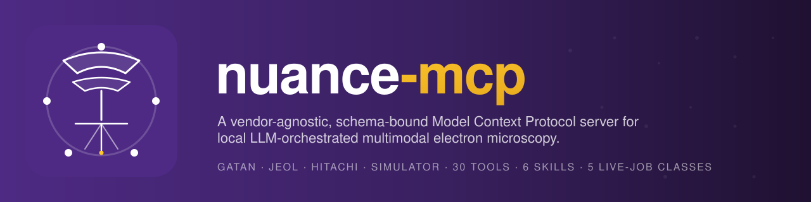

# nuance-mcp

<p align="center">
  
</p>

A **vendor-agnostic, schema-bound Model Context Protocol server** for local
LLM-orchestrated multimodal electron microscopy. The schema-bound tool
layer, persistent live-job lifecycle, declarative skill catalogue, and
physics-plausible simulator sit above an explicit
[`MicroscopeAdapter`](architecture.md) contract. Reference adapters for
**Gatan**, **JEOL**, and a **Hitachi** skeleton ship in the same
package, alongside a hardware-free simulator backend.

!!! tip "If you used `nuance-gms-mcp` or `jeol-mcp` previously"
    See the [migration guide](migration_v0.1_to_v0.2.md). Tool names lose
    the `gms_` prefix; legacy names remain accepted as aliases for one
    deprecation cycle.

## Start here

<div class="grid cards" markdown>

-   :material-rocket-launch: __Installation__

    ---

    Install paths, vendor extras, Python versions.

    [:octicons-arrow-right-24: Read](installation.md)

-   :material-clock-fast: __Quickstart__

    ---

    Five-minute tour: server, Python API, Ollama agent, skills, examples.

    [:octicons-arrow-right-24: Read](quickstart.md)

-   :material-layers-triple-outline: __Architecture__

    ---

    Four-layer design and why the bridge stays small.

    [:octicons-arrow-right-24: Read](architecture.md)

-   :material-shield-check: __Safety & deployment__

    ---

    Bounded execution vs facility safety; deployment table.

    [:octicons-arrow-right-24: Read](safety.md)

</div>

## Reference

| Page                                                                                  | What's in it                                          |
|---------------------------------------------------------------------------------------|-------------------------------------------------------|
| [All 30 tools](tools_reference.md)                                                    | Every typed tool with bounds and behaviour            |
| [Skills](skills.md)                                                                   | Six MCP prompts; anatomy and how to add your own       |
| [Bridge spec 1.0](spec/nuance-mcp-bridge-1.0.md)                                      | Versioned JSON wire protocol                          |
| [Contributing a vendor adapter](contributing_a_vendor.md)                             | Checklist and minimal example                         |
| [Migration v0.1 → v0.2](migration_v0.1_to_v0.2.md)                                    | Renames, env vars, citation                           |

## Citation

```bibtex
@software{dosReis2026NuanceMCP,
  author    = {dos Reis, Roberto and Dravid, Vinayak P.},
  title     = {NUANCE-MCP: A Vendor-Agnostic Schema-Bound Tool Protocol for
               Local LLM-Orchestrated Multimodal Electron Microscopy},
  version   = {0.2.0},
  year      = {2026},
  url       = {https://github.com/NUANCE-IT/nuance-mcp},
}
```

The underlying universal-MCP-for-instrumentation framework is disclosed
under Northwestern Invention Disclosure Disc-ID-25-05-22-002 (Technology
ID 2025-136), accepted 3 June 2025.
